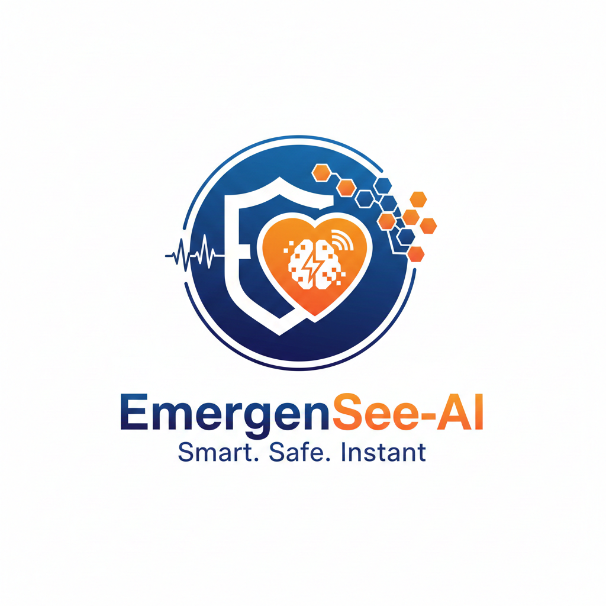
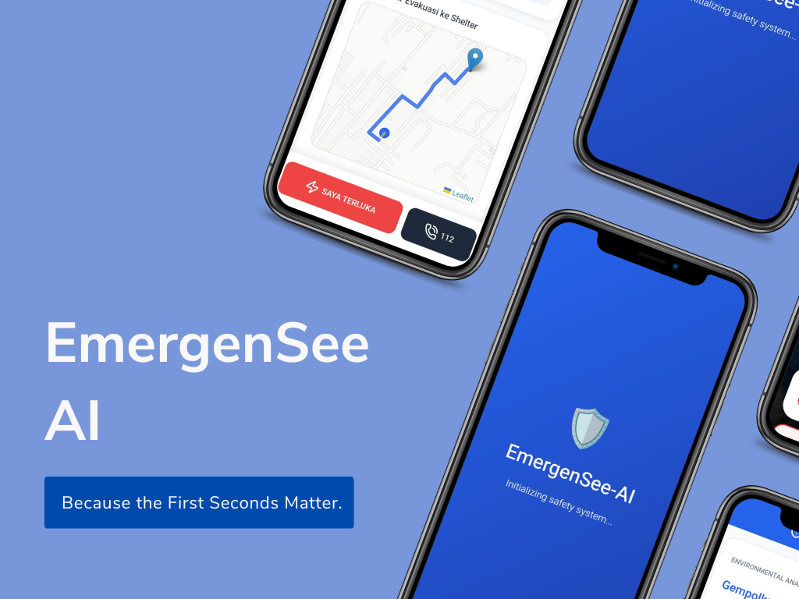
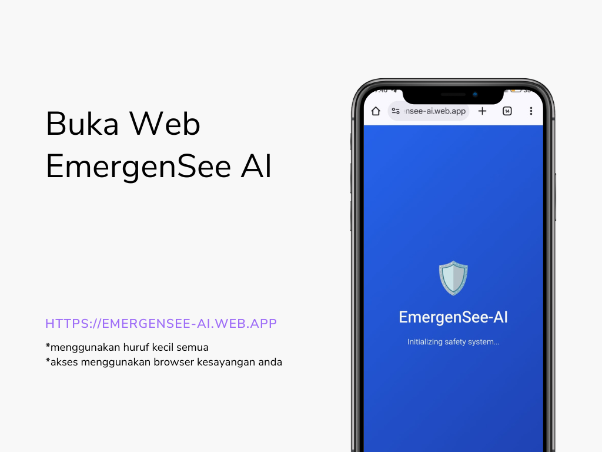
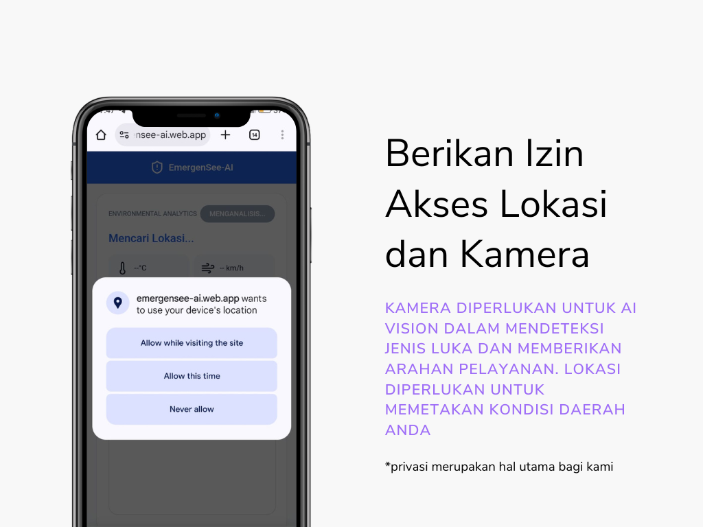
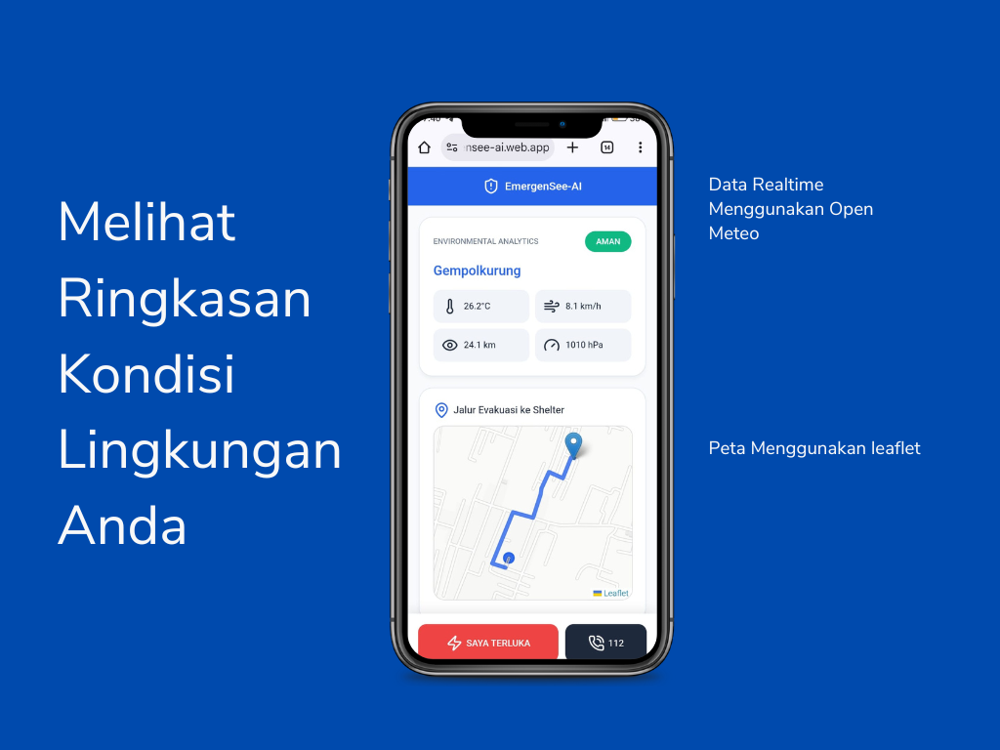
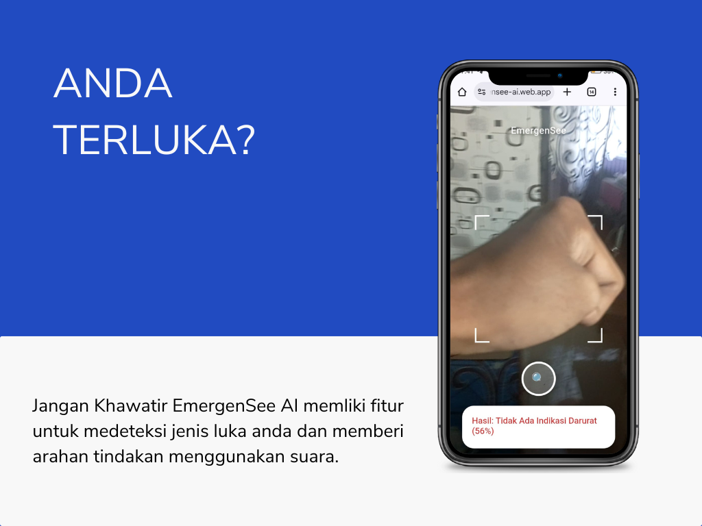
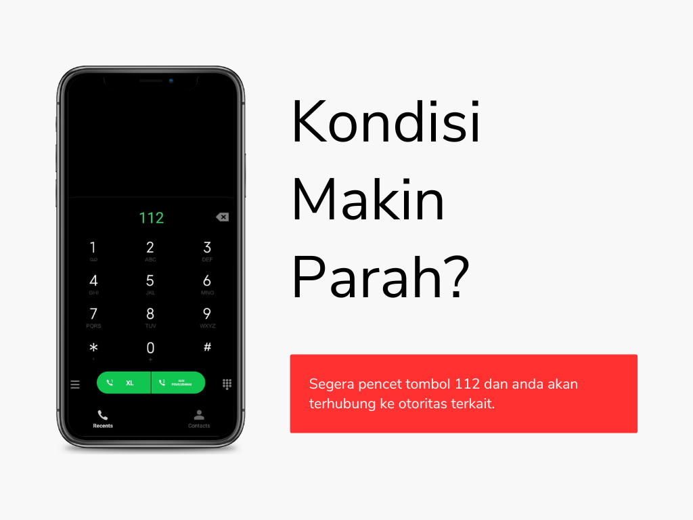
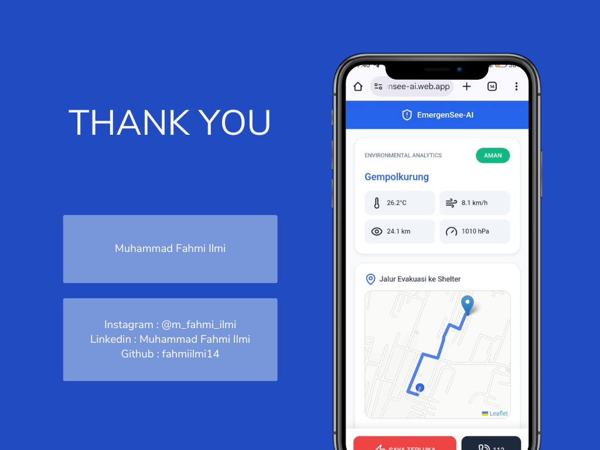

# EmergenSee-AI

**Asisten Darurat dan Pertolongan Pertama Berbasis Artificial Intelligence**

## Problem Statement

Dalam situasi darurat seperti kecelakaan ringan atau bencana alam, masyarakat sering kali mengalami kepanikan dan keterbatasan pengetahuan medis dasar. Hal ini menyebabkan lambatnya pengambilan keputusan awal yang dapat meningkatkan risiko cedera fatal.

Selain itu, informasi mengenai kondisi lingkungan dan jalur evakuasi sering kali tersebar di berbagai platform dan tidak tersedia secara real-time. Dibutuhkan solusi terpadu yang mampu memberikan panduan pertolongan pertama, analisis risiko lingkungan, dan akses layanan darurat dalam satu aplikasi yang cepat dan mudah diakses.

## Deskripsi Produk

EmergenSee-AI adalah aplikasi web berbasis Artificial Intelligence (AI) yang berfungsi sebagai asisten darurat digital. Aplikasi ini memanfaatkan AI Vision untuk mengenali jenis luka melalui kamera dan memberikan instruksi pertolongan pertama yang kontekstual.

Dengan mengintegrasikan data lingkungan real-time dan pemetaan jalur evakuasi, EmergenSee-AI membantu pengguna mengambil tindakan yang tepat sebelum bantuan medis profesional tiba di lokasi.

## Fitur Utama

* **Deteksi Luka Berbasis AI Vision:** Memindai jenis luka melalui kamera untuk memberikan panduan pertolongan pertama secara otomatis.
* **Analisis Lingkungan Real-time:** Menampilkan data suhu, kecepatan angin, jarak pandang, dan tekanan udara untuk mengukur tingkat risiko di lokasi pengguna.
* **Rekomendasi Keselamatan AI Generatif:** Menghasilkan instruksi keselamatan yang spesifik sesuai kondisi pengguna menggunakan Large Language Model (LLM).
* **Peta Jalur Evakuasi:** Menampilkan rute tercepat menuju shelter atau titik aman terdekat berdasarkan lokasi pengguna.
* **Akses Offline:** Fitur deteksi luka tetap dapat berfungsi tanpa koneksi internet dengan memanfaatkan teknologi TensorFlow.js yang berjalan di sisi klien.
* **Tombol Darurat 112:** Akses cepat untuk menghubungi layanan darurat secara langsung.
* **Antarmuka Mobile-First:** Desain yang dioptimalkan untuk perangkat seluler guna memastikan kemudahan penggunaan dalam situasi kritis.

## Teknologi yang Digunakan

| Komponen | Teknologi |
| --- | --- |
| Frontend | HTML, CSS, JavaScript |
| AI Engine | TensorFlow.js (Supervised Learning untuk klasifikasi luka) |
| Environment Data | Open-Meteo API |
| Mapping & Routing | Leaflet.js & Leaflet Routing Machine |
| Location Service | Geolocation API |
| Deployment & Offline | Progressive Web App (PWA) |

## Cara Penggunaan

1. **Akses Aplikasi:** Buka URL EmergenSee-AI melalui browser di perangkat mobile atau desktop.
2. **Izin Akses:** Berikan izin akses lokasi dan kamera saat diminta oleh aplikasi.
3. **Identifikasi Luka:** Arahkan kamera pada luka untuk mendapatkan instruksi penanganan medis awal.
4. **Pantau Lingkungan:** Periksa dasbor analisis lingkungan untuk mengetahui tingkat risiko di sekitar Anda.
5. **Navigasi Evakuasi:** Lihat peta untuk menemukan jalur evakuasi menuju shelter terdekat.
6. **Panggilan Darurat:** Tekan tombol Emergency Call untuk menghubungi layanan 112 jika memerlukan bantuan segera.

**Petunjuk: **

*Catatan: Aplikasi tidak memerlukan proses login untuk memastikan akses instan saat terjadi kondisi darurat.*
---
